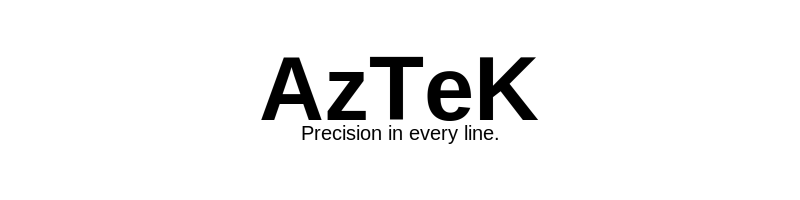

# **Dimitri FAJAL**

Hey there! I’m **Dimitri**, a 20-year-old student with a strong interest in everything tech-related — from coding and electronics, cyber or reverse engineering and tinkering as a whole. I'm always learning and I love it !

- 🎓 Currently studying Computer Science at TSP (Télécom SudParis)
- 🐍 Member of the CodeClique team of the GATE project
- 🚀 Building and launching rockets with Acelspace for over 10 years
> 📌 Don't miss my pinned projects and my website !

## 🔗 My socials

## 🛠️ Tech I've worked with / know extensively

### Languages

### Web

### Science

### CAD

### Tools & Environments

-FCC624?style=flat&logo=linux&logoColor=black)

---

> _“Precision in every line.”_
